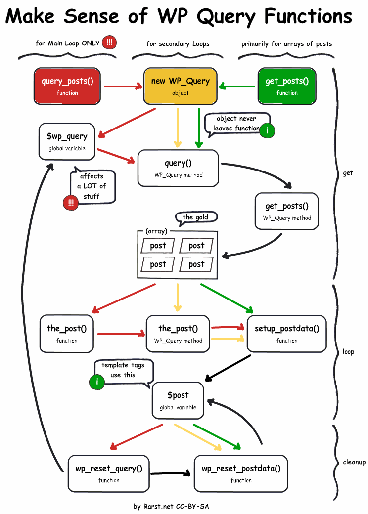

# Queries

## The Main Loop

Every page displayed by WordPress has a main query. This query grabs posts from the database, and is used to determine what template should be loaded.

Once that template is loaded, the main loop begins, allowing the theme to display the posts found by the main query. Here is an example main loop:

```
if ( have_posts() ) {
    while ( have_posts() ) {
        the_post();
        // display post
    }
} else {
    // no posts were found
}
```

## The Main Query and Query Variables

The main query is created using the URL, and is represented by a `WP_Query` object.

This object is told what to fetch using Query Variables. These values are passed into the query object at the start, and must be part of a list of valid query variables.

For example, the query variable 'p' is used to fetch a specific post type, e.g.

    $posts = get_posts( 'p=12' );

Fetches the post with ID 12. The full list of options are available on the `WP_Query` codex entry.

## Making a Query

To retrieve posts from the Database, you need to make a post query. All methods of getting posts are layers on top of the `WP_Query` object.

There are 3 ways to do this:

 - `WP_Query`
 - `get_posts`
 - `query_posts`

This diagram explains what happens in each method:

[](../assets/query_functions.png)

### `WP_Query`

```
$query = new WP_Query( $arguments );
```

### `get_posts`

```
$posts = get_posts( $arguments );
```

`get_posts` is similar to `WP_Query`, and takes the same arguments, but it returns an array containing the requested posts in full. You shouldn't use `get_posts` if you're intending to create a post loop.

### Don't use `query_posts`

`query_posts` is used to modify the main query, however it does this by discarding it and replacing it with a new query. This is incredibly wasteful and has a major performance cost.

Using `query_posts` can encourage bad habits, and cannot be nested inside other queries. Use the `pre_get_posts` filter instead.


## Cleaning up after Queries

### `wp_reset_query`

### `wp_reset_postdata`

## The `pre_get_posts` Filter

## `WPDB`
